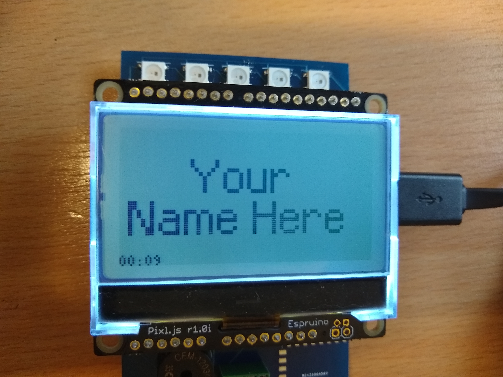

# Vonage Campus Developer Conference Badge

Welcome to [Vonage Campus](https://www.vonage.com/campus/)! This repo is dedicated to the software for the Developer Track Conference Badges.

## Assemble Your Badge

The badge kit contains:

* A [pixl.js](http://www.espruino.com/Pixl.js)
* A badge circuit board
* A battery pack

Put batteries in your battery pack and check the switch is **off** before you plug it into your board (look for a little sticky out bit on the plug and a groove on the socket for it to slot into).

The pixl fits onto the board. The board has five lights along the top of it, and the pixl has a microUSB socket on its right hand side so hopefully this helps to line up the pieces!

Now turn it on, you will get to a screen that says "Your Name Here".

## Buttons

If you look at the sides of the screen you will find four (small) buttons. These are:

* **BTN1** in the top left
* **BTN2** in the top right
* **BTN3** in the bottom right
* **BTN4** in the bottom left

The left hand side controls the menu (BTN1 and BTN4 to go up and down respectively), and BTN3 in the bottom right selects.

## Configuring Your Name

You can set your own name! Actually "First Name" is more like "top line of text" and "Second Name" is really "second line of text" so do whatever you like with these fields.

1. Enable the bluetooth on your badge by selecting "Make Connectable" from the menu.

2. Go to <https://nodebadge.org/name/> on your phone and enter your details.

3. Click "Send to Badge".

4. Turn your badge off and on again.

Well done! You and your badge are friends now :)

## Badge Features

We've put together some ready-made bits and bobs for you to enjoy in between letting your badge display your name today. They each have their own wiki page:

* [Backlight](https://github.com/nexmo-community/campusbadge/wiki/Backlight)
* [Lights](https://github.com/nexmo-community/campusbadge/wiki/Lights)
* [Sound](https://github.com/nexmo-community/campusbadge/wiki/Sound)
* [DTMF Dialer](https://github.com/nexmo-community/campusbadge/wiki/DTMFDialer)
* [T-Rex](https://github.com/nexmo-community/campusbadge/wiki/T-Rex)
* [Flappy Bird](https://github.com/nexmo-community/campusbadge/wiki/FlappyBird)

## Badge Code

All the code on your badge is here in this repository. If you want to tinker with your new gadget, or if you need to put the original code back onto the badge (these two things may be related) then you can do that here:

<https://www.espruino.com/ide/?codeurl=https://raw.githubusercontent.com/nexmo-community/campusbadge/master/software/badge.js> (devices bigger than a phone are recommended for this part)

Go to the picture of a cog in the top right access your settings:

1. In "Communications", set "Save on Send" to `Direct to Flash (execute code at boot)`
2. Also in "Communications",  the option for "Module Extensions" should be checked

On the badge, choose "Make Connectable" from the menu, and it will tell you its name at the bottom of the screen.

Back in your web browser, click the yellow "connect" icon in the top left and find your device by name. Finally - click the "Send to Espruino" icon in the middle bar with the up arrow on it.

You can edit the code in the editor and upload your changes!

**Pro-tip:** If you get to a point where you can't boot, turn off the badge, hold down BTN1 (top left), turn the power on and keep on holding down the button until it says it has unloaded the saved code.

## About and Acknowledgements

The Vonage Campus Developer Track Badge is based heavily on the [NodeConfEU Badge from 2018](https://github.com/nearform/nceubadge2018). Many thanks to them for sharing their fun with us :)

